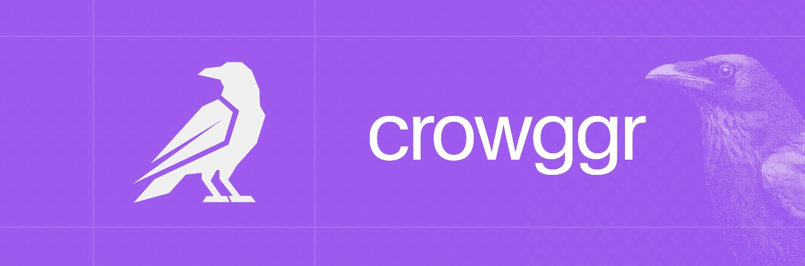

<p align="center">
	<h1 align="center"><b>Crowggr</b></h1>
<p align="center">
    Open-source headless blog CMS you'll actually enjoy. That's it. That's the pitch.
    <br />
    <br />
    <a href="https://docs.crowggr.com">Docs</a>
    ·
    <a href="https://x.com/crowggr">X.com</a>
    ·
    <a href="https://github.com/crowggr/crowggr/issues">Issues</a>
  </p>
</p>

### Key Features

- Headless API - Fetch posts from any frontend
- Image Uploads - Drag & drop media library with CDN
- Multi-site - Manage multiple blogs from one dashboard
- Team Support - Invite authors and collaborators
- Built-in billing & subscriptions via Polar.sh

#### Prerequisites

- **Bun** (package manager)
- **PostgreSQL** database

### Project Structure

This monorepo is managed with [Turborepo](https://turbo.build/repo) and [Bun workspaces](https://bun.sh/docs/install/workspaces).

```
crowggr/
├── apps/
│   ├── dashboard/          # Admin dashboard (TanStack Start)
│   ├── docs/               # Documentation site
│   └── web/                # Marketing website
│
└── packages/
    ├── api/                # oRPC API routes
    ├── auth/               # Better Auth + Polar integration
    ├── db/                 # Drizzle ORM (PostgreSQL)
    ├── client/             # @crowggr/client SDK
    ├── react/              # @crowggr/react hooks
    └── tanstack/           # @crowggr/tanstack integration
```

### Stack

- **Frontend:** TanStack Start, React 19, Tailwind CSS v4
- **Database:** PostgreSQL with Drizzle ORM
- **Auth:** Better Auth with GitHub/Google OAuth
- **Billing:** Polar.sh for subscriptions and payments
- **UI:** Coss UI components
- **API:** oRPC for end-to-end type-safe APIs
- **Monorepo:** Turborepo + Bun workspaces

### Quick Start

**Cloud (Recommended)**

Sign up at [crowggr.com](https://crowggr.com) and start writing in minutes.

**Self-Hosted**

```bash
git clone https://github.com/crowggr/crowggr
cd crowggr
cp .env.example .env
bun install
bun dev
```

### SDK

```bash
bun add @crowggr/react
```

```typescript
import { usePosts } from '@crowggr/react';

function Blog() {
  const { data: posts } = usePosts();

  return (
    <ul>
      {posts.map(post => (
        <li key={post.id}>{post.title}</li>
      ))}
    </ul>
  );
}
```

### [Docs](https://docs.crowggr.com)

- [Quick Start Guide](https://docs.crowggr.com/getting-started) - Get up and running in minutes
- [SDK Documentation](https://docs.crowggr.com/sdk) - Integrate Crowggr into your app
- [Self-Hosting](https://docs.crowggr.com/self-hosting) - Deploy on your own infrastructure

### Contributing

See [CONTRIBUTING.md](./CONTRIBUTING.md) for guidelines.

### License

MIT
